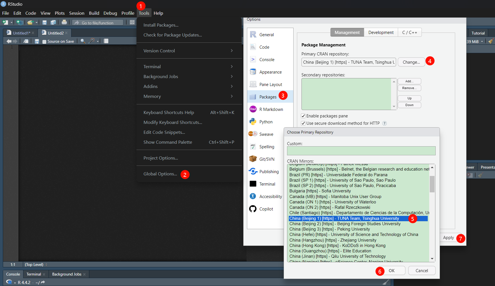
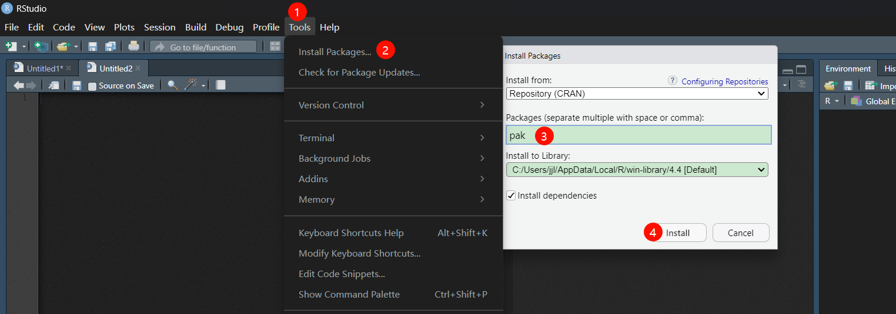
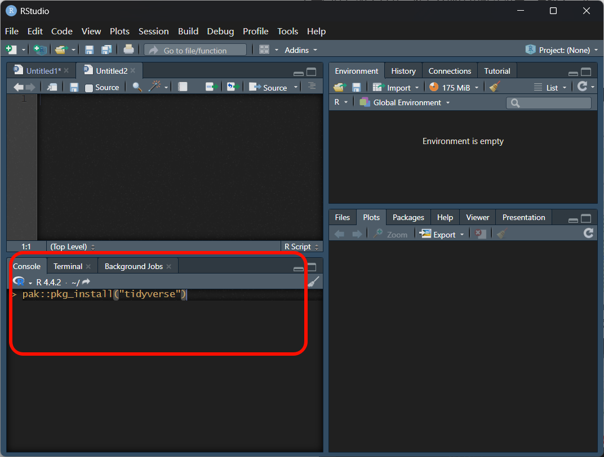
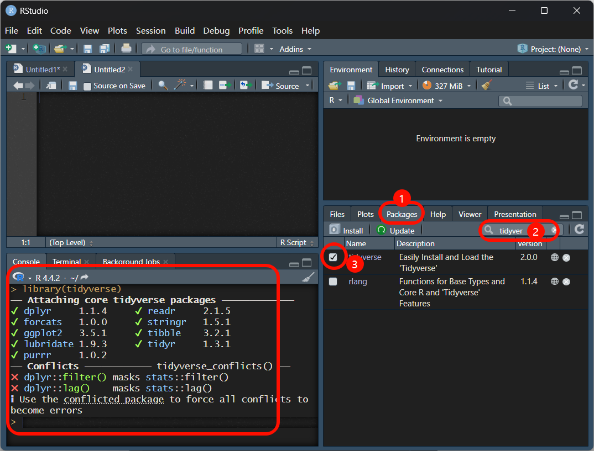
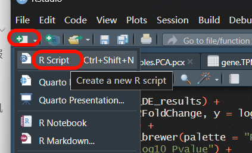
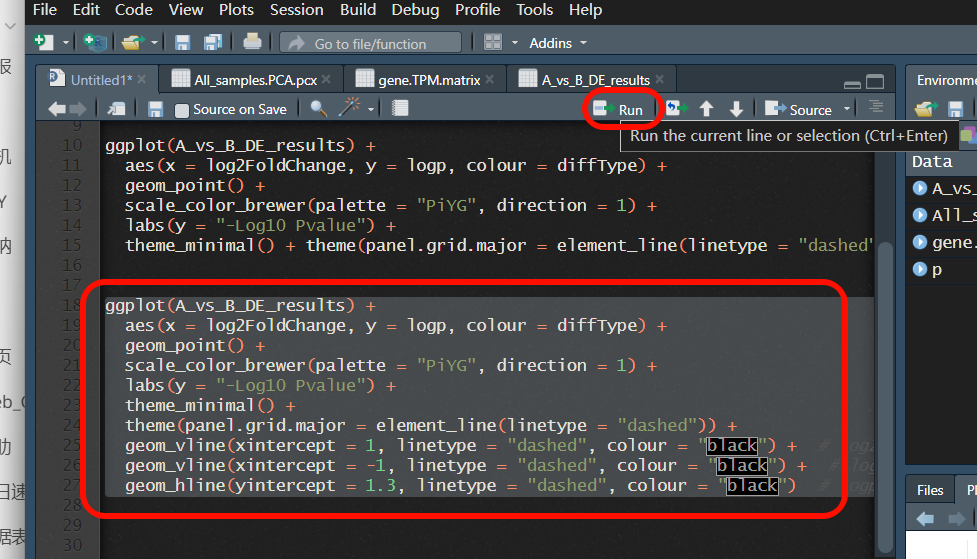

# 培训 - 202411

## 目录

- [Rstudio相关基础](#Rstudio相关基础)
  - [下载安装](#下载安装)

  - [基础设置](#基础设置)

# Rstudio相关基础

## 下载安装

RStudio：目前公认最好的 R 语言 IDE。下面3个请依次安装：

> 安装时**推荐全部使用默认设置**，直接下一步；**更改了安装路径的，出问题自己解决**

> 国内网盘： https://cowtransfer.com/s/b84c50e93b8243；密码：w3l88t。（此链接2025年1月23过期）

1. R语言：[清华镜像下载-Windows](https://mirrors.tuna.tsinghua.edu.cn/CRAN/bin/windows/base/); [其他版本](https://mirrors.tuna.tsinghua.edu.cn/CRAN/)

2. RTools(仅windows)：[Rtools-windows](https://cran.rstudio.com/bin/windows/Rtools/)

3. Rstudio下载：[rstudio-desktop](https://posit.co/download/rstudio-desktop/)

完成后双击打开Rstudio，如果出现一个选择的对话框，选择64位，点OK

## 基础设置

1. 设置镜像

   > 有时候改了镜像反而经常安装失败，你可以再改回去

   
2. 安装pak，这个包能够更加方便的安装其他包，比自带的好用，但有时候也会抽风，随便你用哪个安装都行。

   
3. 安装其他包；左下角区域输入`pak::pkg_install("tidyverse")`，并按下回车。其中引号内为包名。
   > 部分包也可以直接使用上面安装pak的方法
   
4. 加载包

   
5. 运行代码
   1. 左上角为打开的文件或变量预览区。新建文件后会直接在左上角打开。

      
   2. 选中代码点击run运行

      

