# 示例网页展示

> 会生成`graphml`文件，可以直接用 [Gephi](https://gephi.org/) 打开进行细节调整

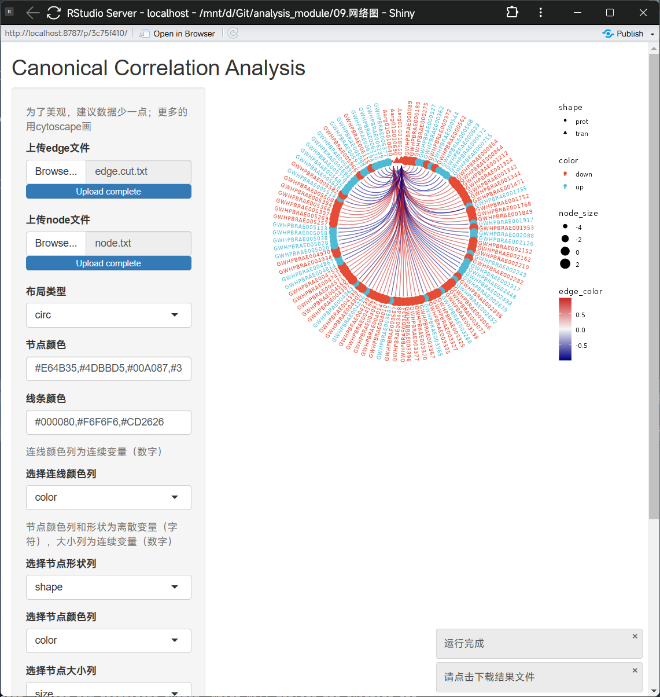

# Cytoscape教程

## 目录

- [安装](#安装)

- [使用](#使用)
  - [打开软件](#打开软件)

  - [导入网络信息](#导入网络信息)

  - [导入节点属性信息](#导入节点属性信息)

  - [编辑颜色](#编辑颜色)

  - [编辑形状](#编辑形状)

- [导出](#导出)
  - [图片导出](#图片导出)

  - [cys格式](#cys格式)

- [插件](#插件)

- [温馨提示](#温馨提示)

> 温馨提示：教程看两遍，第二遍再跟着操作，可以极大减少出错概率。

## 安装

1. 进入[官网](https://cytoscape.org/download.html "官网")点击`Download`下载最新版。根据系统不同这里会显示`for Windows`或`for Mac`，直接点击即可。
   > 温馨提示：认准官网域名 [cytoscape.org](http://cytoscape.org "cytoscape.org")
   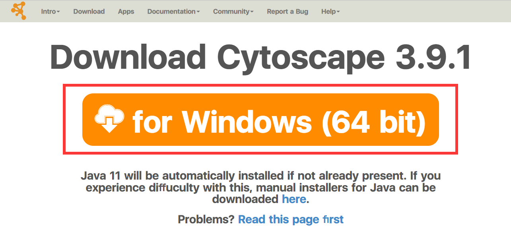
2. 下载完成后双击安装包。点击`Next`，然后点击同意用户协议，之后一直点击`Next`即可。
3. 安装过程中如果弹出缺少`java`，直接点击弹窗的`Download`按钮即可。

   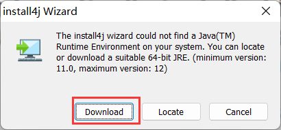
4. 因为网络原因可能在下载`cytoscape`和`java`过程中速度较慢，耐心等待或使用魔法。

## 使用

### 打开软件

双击图标打开软件，如果弹出网络权限，点击允许即可。

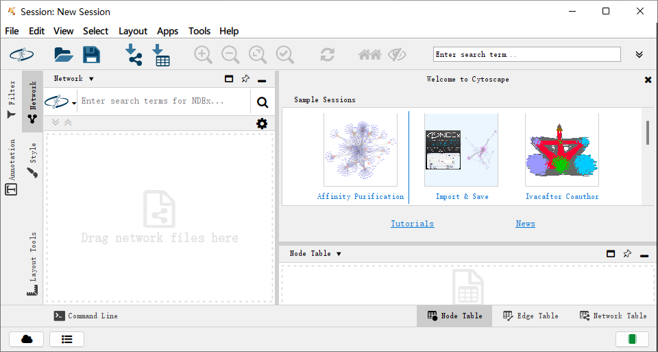

### 导入网络信息

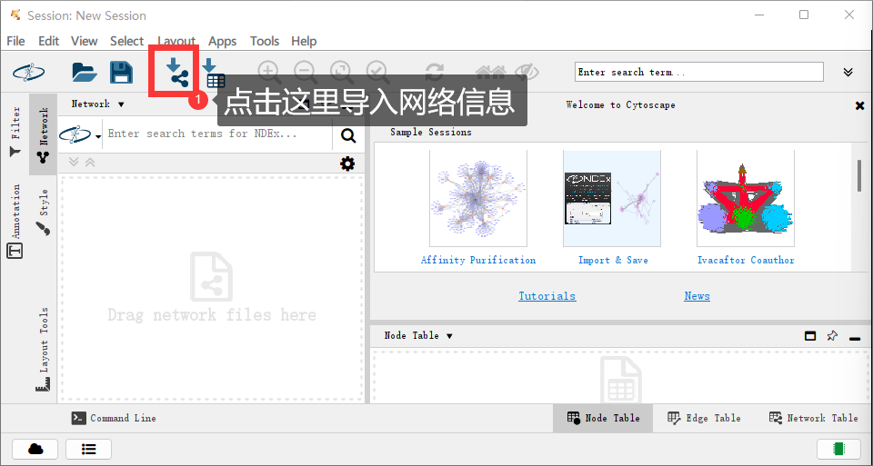

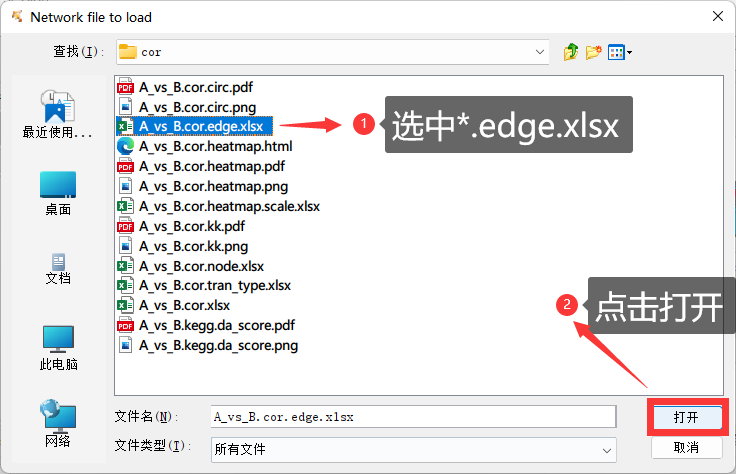

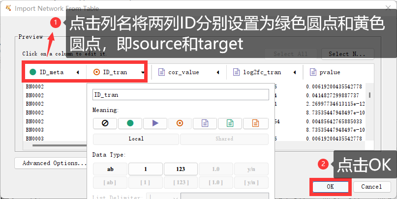

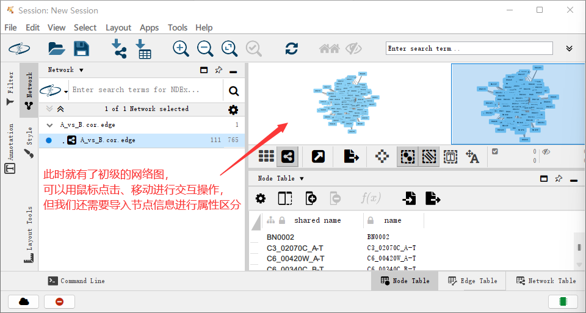

### 导入节点属性信息

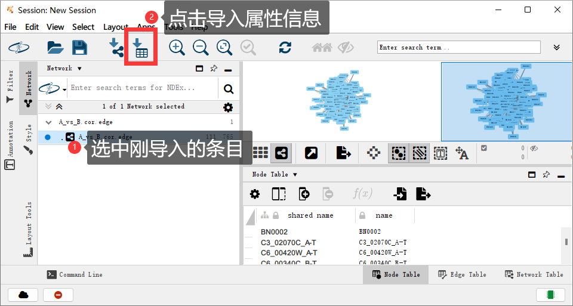

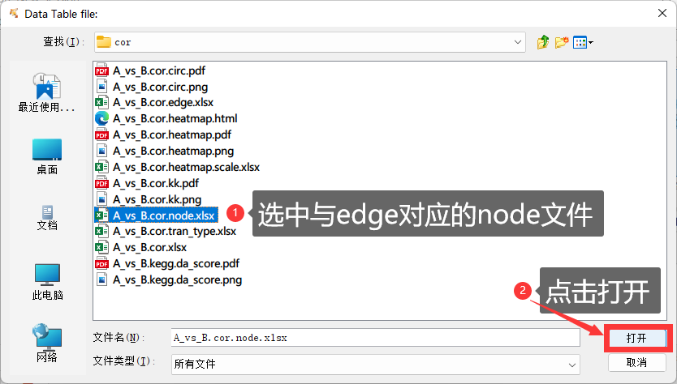

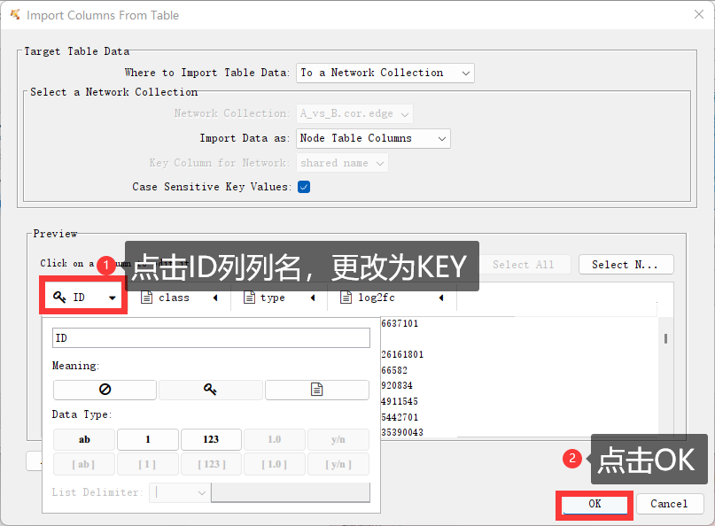

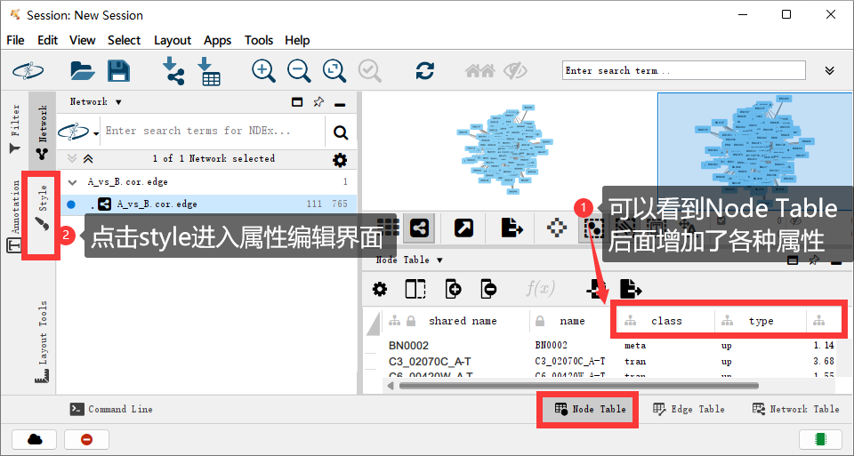

### 编辑颜色

1. 点击`Fill Color`后面的小箭头展开
2. `Column`选择`type`
3. `Mapping Type` 选择 `Discrete Mapping `
4. 点击属性后面的三小点选择颜色

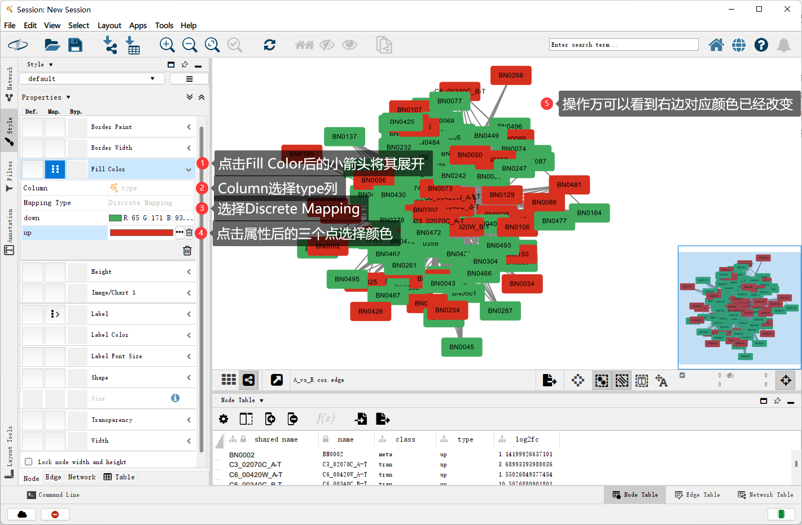

### 编辑形状

> 和编辑颜色一致，这里不做过多阐述

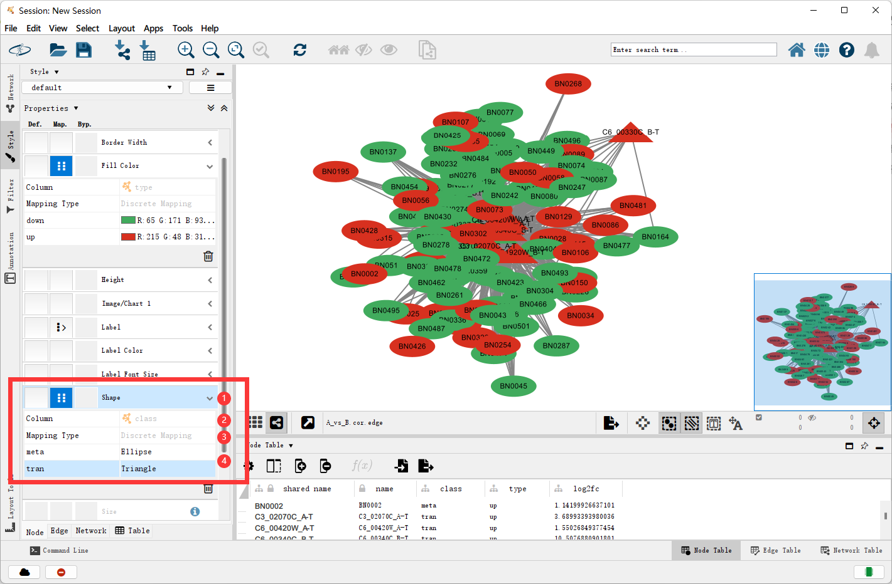

## 导出

### 图片导出

> 可以导出矢量图使用其他矢量图编辑

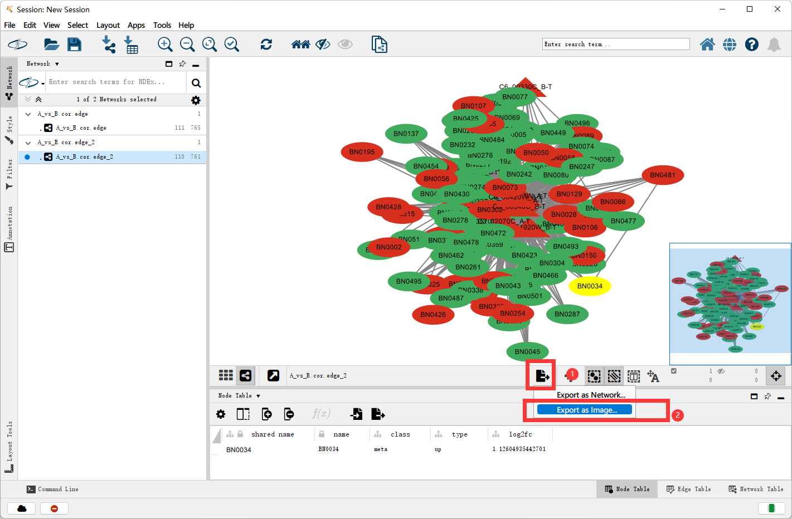

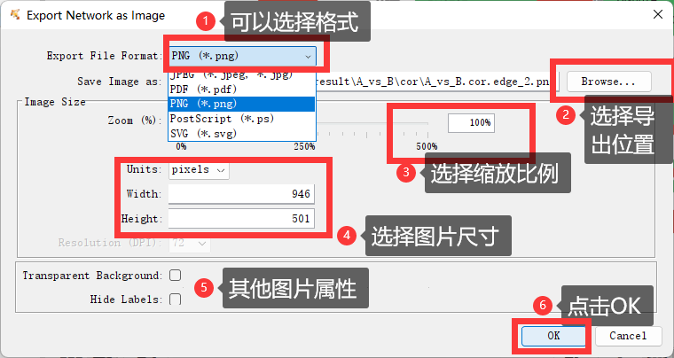

### cys格式

> 此格式可以将现有布局保存，下次可以直接打开cys文件在上次的基础上继续更改

> 关闭软件时也会提示你是否保存，建议点击保存并退出

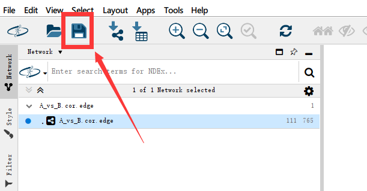

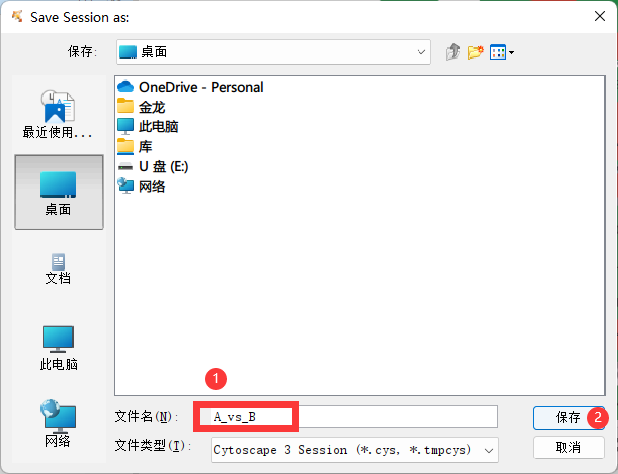

## 插件

[https://apps.cytoscape.org/](https://apps.cytoscape.org/ "https://apps.cytoscape.org/")

寻找插件，点击安装即可。具体插件的使用方法请看插件介绍

[https://apps.cytoscape.org/apps/KEGGscape](https://apps.cytoscape.org/apps/KEGGscape "https://apps.cytoscape.org/apps/KEGGscape")

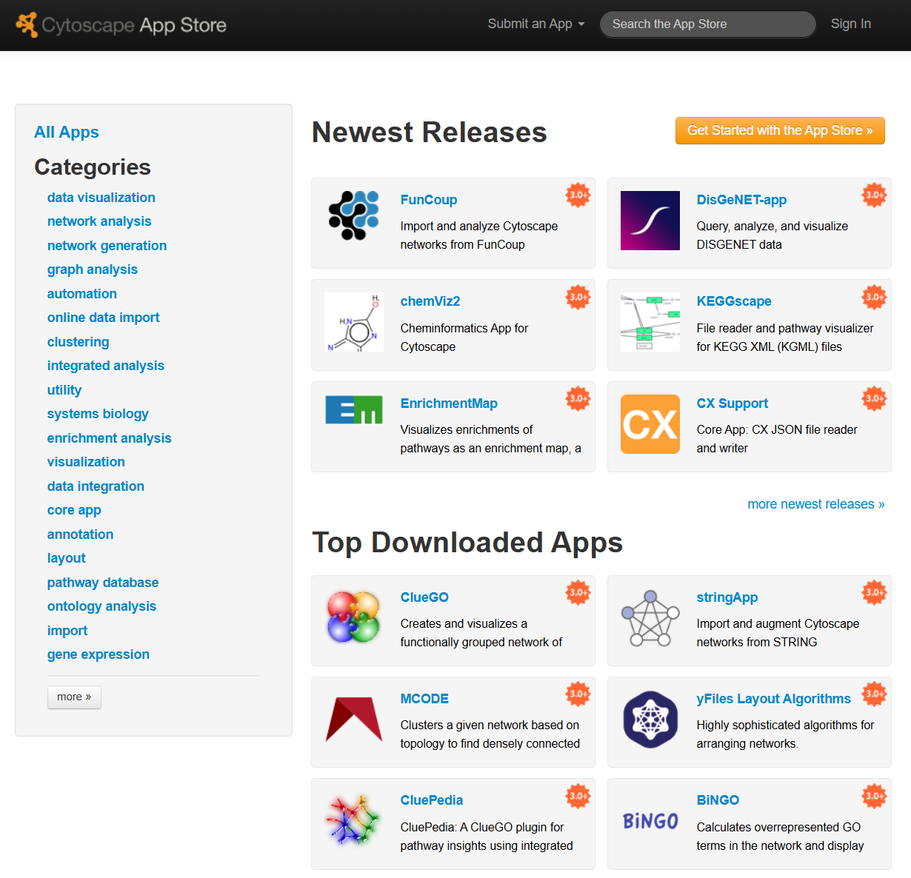

## 温馨提示

1. 因为网络原因软件下载速度可能会较慢。
2. 教程中将上下调映射到颜色，类型映射到形状，您可以根据需要更改映射关系。
3. 右上角的网络图区域是可以交互操作的，可以鼠标左键点击、移动，右键删除、添加新的连接......
4. 建议操作完保存一份cys格式文件，方便下次编辑。
5. 这只是初级极简教程。Cytoscape教程网络上很多，您可以去[知乎](https://www.zhihu.com/search?type=content\&q=Cytoscape "知乎")、[BiliBili](https://search.bilibili.com/all?keyword=Cytoscape "BiliBili")等网站搜索更加详细的教程。
