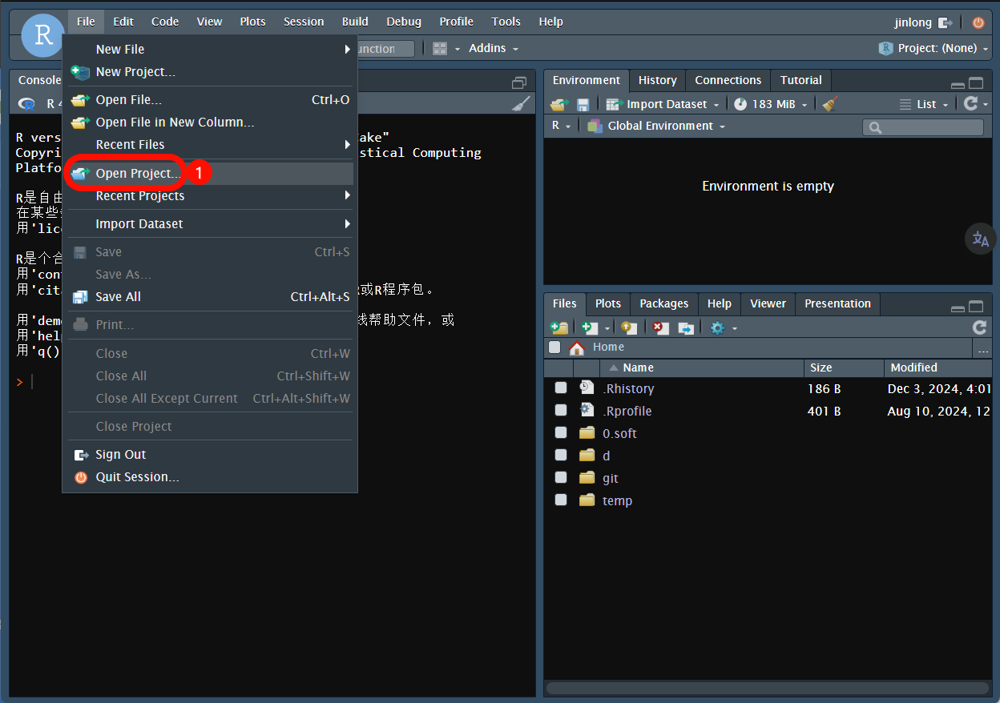
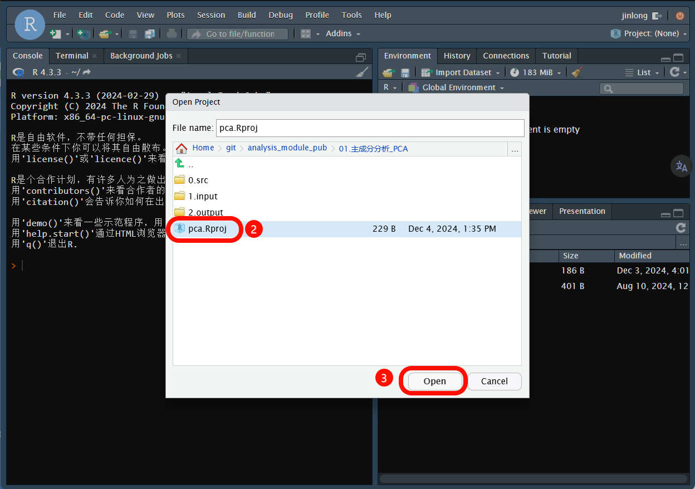
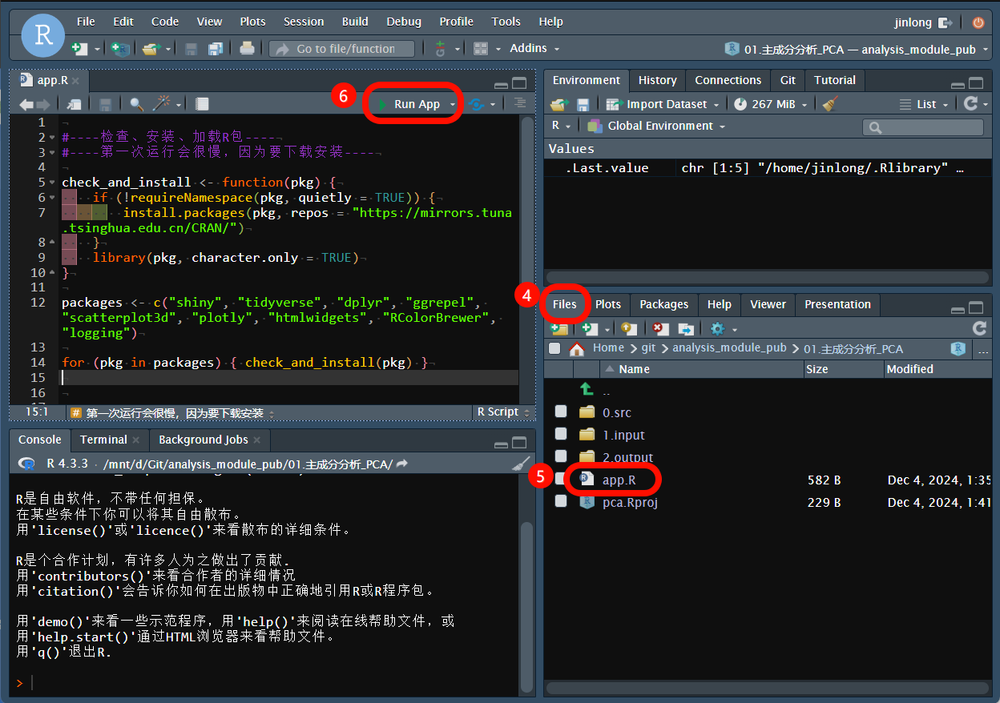
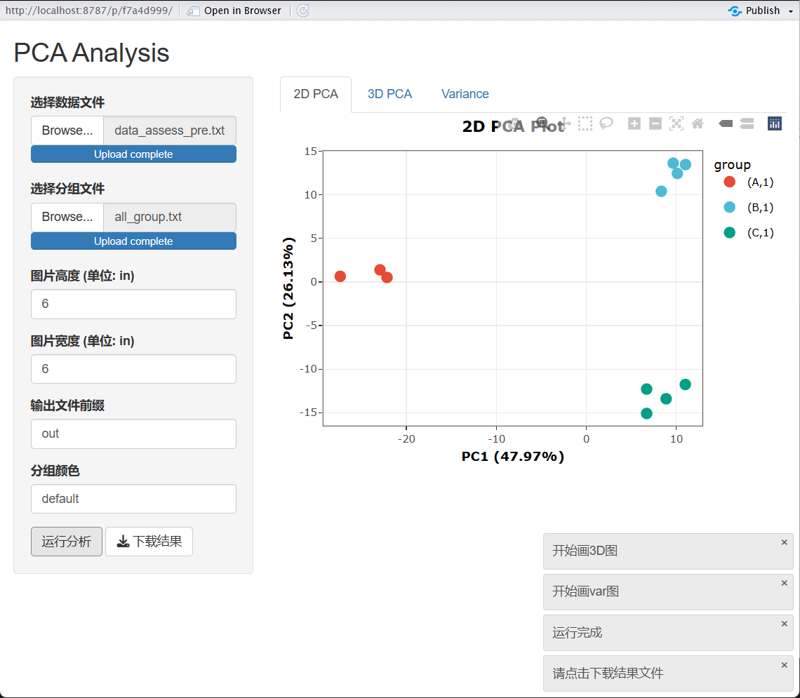

# 使用方法

1. 下载项目

2. 安装包并打开rstudio；如果没有可以看教程 [rstudio.install.md](./00.lib/rstudio.install.md)，看完“基础设置”即可；

3. 左上角 File -> open project, 选择 .Rproj 文件并打开

4. 右下角File, 点击 app.R 打开文件，左上角窗口点击 run app；

5. 按照提示操作即可；示例文件一般在 1.input

6. 图片示例

    

    

    

    

